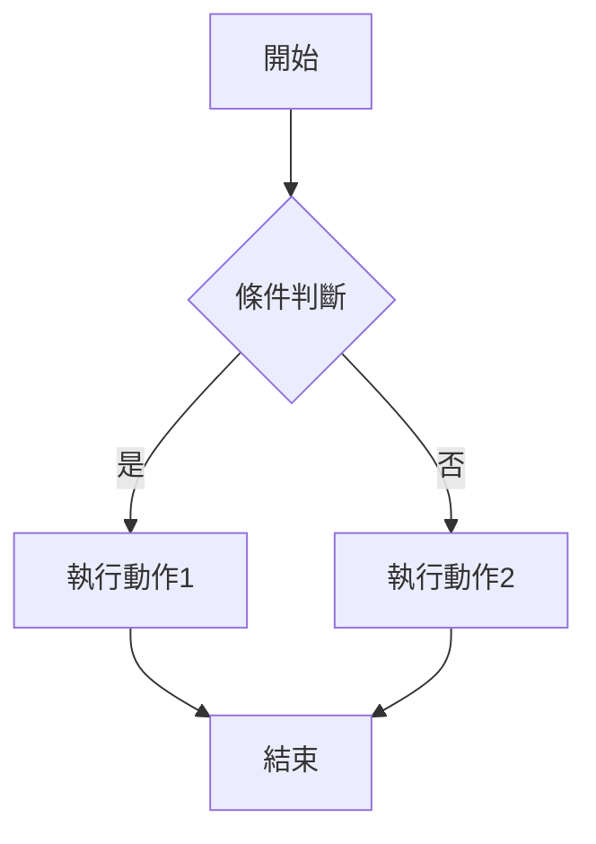
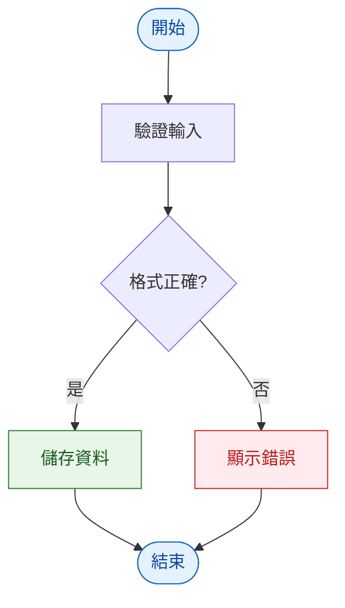
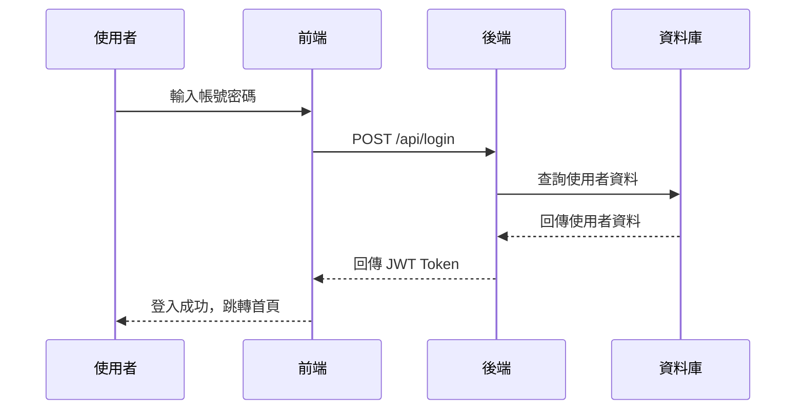
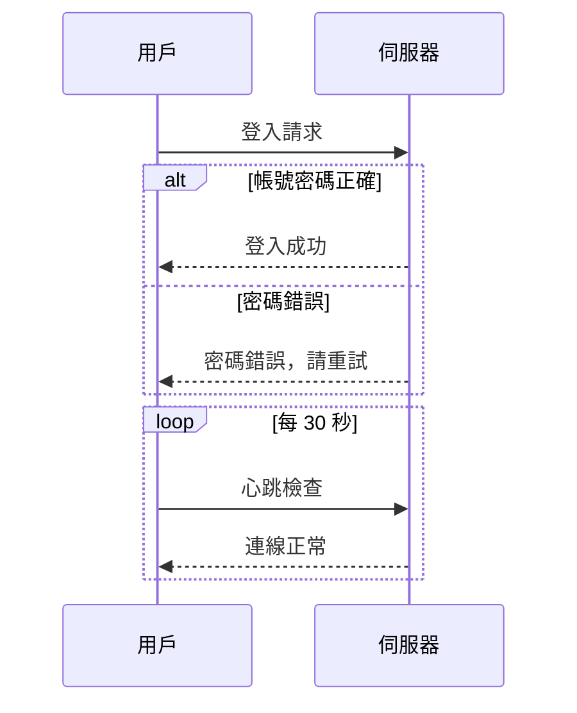

## 簡介

Mermaid 是一個可以使用簡單的語法來建立視覺化圖表的工具，相比 Draw.io，Mermaid 的優勢在於可以使用程式碼來描述圖表，方便版本控制。

## 流程圖

### 基本語法

第一行需要宣告圖表的類型和方向，`TD` 代表從上到下，`LR` 代表從左到右，是最常使用的兩種。

重點說明:

- A[文字]: 方括號代表方形節點
- B{文字}: 大括號代表菱形節點（用於表示條件判斷）
- -->: 箭頭連線
- -->|文字|: 箭頭連線上可以加上文字，表示條件或說明



graph TD
A[開始] --> B{條件判斷}
B -->|是| C[執行動作1]
B -->|否| D[執行動作2]
C --> E[結束]
D --> E[結束]



### 節點形狀

有許多不同的節點形狀，根據不同的情境選用:

| 語法      | 形狀       | 說明             |
| --------- | ---------- | ---------------- |
| A[文字]   | 方形       | 一般步驟、動作   |
| A(文字)   | 圓角方形   | 一般步驟、動作   |
| A{文字}   | 菱形       | 判斷、條件分支   |
| A([文字]) | 體育場形   | 開始、結束       |
| A((文字)) | 圓形       | 連接點           |
| A[[文字]] | 子程序     | 函式、子流程     |
| A[/文字/] | 平行四邊形 | 輸入/輸出        |
| A[(文字)] | 圓柱形     | 資料庫、資料儲存 |
| A{{文字}} | 六邊形     | 初始化、預備過程 |

### 連線類型

除了基本的箭頭連線，還有其他連線類型可以使用:

| 語法     | 連線類型 | 說明                                                       |
| -------- | -------- | ---------------------------------------------------------- |
| A --> B  | 實線箭頭 | 代表流程的進行順序與方向                                   |
| A <--> B | 雙向箭頭 | 表示兩個流程或步驟之間具有「相互關聯」或「雙向互動」的關係 |
| A -.-> B | 虛線箭頭 | 表示「替代流程」、「補充說明」或「跳躍流程」               |

### 節點樣式

預設的節點都是同一種顏色，如果想要讓特定節點有不同的視覺效果，可以用 style 語法來自訂填充色、邊框色、文字色等屬性:

style 節點ID 後面接 CSS 屬性，常用的有 fill（填充色）、stroke（邊框色）、color（文字色）、stroke-width（邊框粗細）。



flowchart LR
A[開始] --> B[處理中] --> C[完成]
style A fill:#e1f5fe,stroke:#0288d1,color:#01579b
style B fill:#fff3e0,stroke:#ef6c00,color:#e65100
style C fill:#e8f5e9,stroke:#2e7d32,color:#1b5e20



### 樣式類別

如果有很多節點要套用同一種樣式，一個一個寫 style 會很冗長。這時候可以用 classDef 先定義樣式類別，再用 class 一次套用到多個節點:



flowchart TD
A([開始]) --> B[驗證輸入]
B --> C{格式正確?}
C -->|是| D[儲存資料]
C -->|否| E[顯示錯誤]
D --> F([結束])
E --> F

    classDef success fill:#e8f5e9,stroke:#2e7d32,color:#1b5e20
    classDef danger fill:#ffebee,stroke:#c62828,color:#b71c1c
    classDef normal fill:#e3f2fd,stroke:#1565c0,color:#0d47a1

    class A,F normal
    class D success
    class E danger



## 循序圖

循序圖適合描述多個角色或系統之間的互動順序，像是 API 呼叫流程、使用者操作步驟、微服務之間的通訊等。如果要跟工程師溝通「這個功能前後端怎麼互動」，循序圖是最好的工具。

### 基本語法


sequenceDiagram
participant 使用者
participant 前端
participant 後端
participant 資料庫

    使用者->>前端: 輸入帳號密碼
    前端->>後端: POST /api/login
    後端->>資料庫: 查詢使用者資料
    資料庫-->>後端: 回傳使用者資料
    後端-->>前端: 回傳 JWT Token
    前端-->>使用者: 登入成功，跳轉首頁



重點說明:

- participant：宣告參與者，會依照宣告順序排列
- ->>：實線箭頭（請求）
- -->>：虛線箭頭（回應）
- 冒號後面是訊息內容

### 進階語法：條件與迴圈

循序圖還支援 alt（條件分支）和 loop（迴圈）語法，可以表達更複雜的邏輯:

alt 和 else 用來表示「如果…否則…」的情況，loop 用來表示重複執行的動作，最後都要用 end 結尾。


sequenceDiagram
participant 用戶
participant 伺服器

    用戶->>伺服器: 登入請求

    alt 帳號密碼正確
        伺服器-->>用戶: 登入成功
    else 密碼錯誤
        伺服器-->>用戶: 密碼錯誤，請重試
    end

    loop 每 30 秒
        用戶->>伺服器: 心跳檢查
        伺服器-->>用戶: 連線正常
    end



## 常用語法速查表

| 圖表類型 | 關鍵字          | 適合場景             |
| -------- | --------------- | -------------------- |
| 流程圖   | flowchart TD/LR | 流程、決策、系統架構 |
| 循序圖   | sequenceDiagram | API 互動、系統通訊   |
| 類別圖   | classDiagram    | 資料模型、系統設計   |
| 狀態圖   | stateDiagram-v2 | 狀態流轉、工單流程   |
| 甘特圖   | gantt           | 專案時程、排程規劃   |
| ER 圖    | erDiagram       | 資料庫設計、資料關聯 |
| 圓餅圖   | pie             | 比例分配、數據呈現   |
| 心智圖   | mindmap         | 腦力激盪、知識整理   |

## 參考文獻

- [Mermaid 語法教學｜用文字畫流程圖、循序圖、甘特圖，AI 時代高效的圖表工具](https://klab.tw/2026/04/mermaid-tutorial/)
